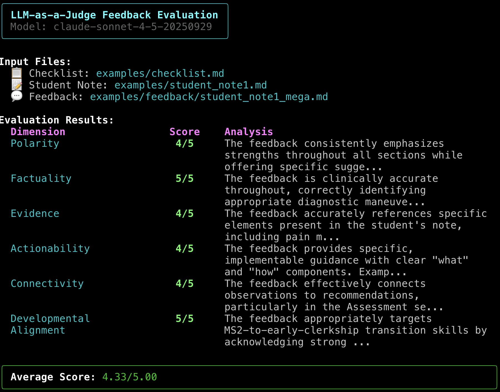

# LSL Beyond Single-Loop Feedback

Sample code for experiments on using LLM-as-a-judge techniques to monitor the quality of narrative feedback in medical education.

## Citation

**Holcomb MJ, Dalton TO, Jamieson AR.** Beyond Single-Loop Feedback: A Self-Validating LLM System for Medical Student Documentation Assessment. Presentation at: Learn Serve Lead 2025: The AAMC Annual Meeting; November 1-5, 2025; San Antonio, TX.

### Authors

- **Michael J. Holcomb, MS**¹ - Lyda Hill Department of Bioinformatics, University of Texas Southwestern Medical Center, Dallas, TX
- **Thomas O. Dalton, MD**² - Department of Internal Medicine, University of Texas Southwestern Medical Center, Dallas, TX
- **Andrew R. Jamieson, PhD**¹ - Lyda Hill Department of Bioinformatics, University of Texas Southwestern Medical Center, Dallas, TX

¹Lyda Hill Department of Bioinformatics, University of Texas Southwestern Medical Center
²Department of Internal Medicine, University of Texas Southwestern Medical Center

---



## Overview

This repository contains:
- **Judge evaluation system**: A Python script that uses Claude to evaluate feedback quality across 6 dimensions
- **Prompts**: Templates for generating and evaluating narrative feedback
- **Examples**: Sample clinical cases, checklists, student notes, and feedback

## Quick Start

### 1. Installation

```bash
# Create and activate virtual environment
python -m venv .venv
source .venv/bin/activate  # On Windows: .venv\Scripts\activate

# Install Python dependencies
pip install -r requirements.txt

# Set your Anthropic API key (choose one method)

# Option A: Using environment variables (temporary, current session only)
export ANTHROPIC_API_KEY='your-api-key-here'

# Option B: Using .env file (recommended, persistent)
echo "ANTHROPIC_API_KEY=your-api-key-here" > .env
```

### 2. Run the Judge

```bash
# Basic usage (outputs to output.json by default)
python judge_feedback.py \
  examples/checklist.md \
  examples/student_note1.md \
  examples/feedback/student_note1_simple.md

# Specify custom output path
python judge_feedback.py \
  examples/checklist.md \
  examples/student_note2.md \
  examples/feedback/student_note2_mega.md \
  -o evaluation_results.json

# Use a different Claude model
python judge_feedback.py \
  examples/checklist.md \
  examples/student_note1.md \
  examples/feedback/student_note1_simple.md \
  --model claude-3-opus-20240229
```

### 3. View Results

The script provides:
- **Beautiful terminal output** with color-coded scores and summaries
- **JSON output file** with complete metadata, parsed scores, analyses, and raw response

## Evaluation Dimensions

The judge evaluates feedback across six dimensions (1-5 scale each):

### Performance Indicator (tracked separately)
- **Polarity (Sentiment)**: Does the feedback tone appropriately match the student's performance level? This dimension indicates whether feedback is positive/negative/mixed, reflecting the student's performance. It is NOT a quality metric—feedback should be negative if the student performed poorly.

### Quality Dimensions (contribute to total score out of 25)
1. **Factuality (Clinical Accuracy)**: Is the feedback medically accurate?
2. **Evidence (Groundedness)**: Does feedback align with actual note content?
3. **Actionability (Guidance Quality)**: Can students understand what actions to take?
4. **Connectivity (Linking to Performance)**: Are suggestions logically connected to observations?
5. **Developmental Alignment**: Is feedback appropriate for MS2 students transitioning to clerkship?

The **Total Quality Score** is calculated by summing the five quality dimensions (maximum 25 points).

## Repository Structure

```
lsl-beyond-single-loop-feedback/
├── judge_feedback.py           # Main evaluation script
├── requirements.txt            # Python dependencies
├── README.md                   # This file
├── LICENSE                     # Academic research license
├── .gitignore                  # Git ignore patterns
│
├── prompts/
│   ├── feedback/
│   │   ├── simple_feedback.md  # Concise feedback generation prompt
│   │   └── mega_feedback.md    # Detailed feedback with reflection prompt
│   └── judge/
│       └── judge.md            # LLM-as-judge evaluation prompt
│
├── resources/
│   └── screenshot.png          # Terminal output screenshot
│
└── examples/
    ├── case.md                 # OSCE case: Acute Appendicitis
    ├── checklist.md            # Evaluation checklist
    ├── student_note1.md        # Strong performance example
    ├── student_note2.md        # Weak performance example
    └── feedback/
        ├── student_note1_simple.md   # Simple feedback for strong student
        ├── student_note1_mega.md     # Detailed feedback for strong student
        ├── student_note2_simple.md   # Simple feedback for weak student
        └── student_note2_mega.md     # Detailed feedback for weak student
```

## JSON Output Format

The output JSON file contains structured results with polarity tracked separately from quality dimensions:

```json
{
  "metadata": {
    "timestamp": "2025-11-02T10:30:00.123456",
    "model": "claude-sonnet-4-5-20250929",
    "inputs": {
      "checklist_path": "/path/to/checklist.md",
      "student_note_path": "/path/to/student_note.md",
      "feedback_path": "/path/to/feedback.md"
    }
  },
  "evaluation": {
    "polarity": {
      "score": 4,
      "analysis": "The feedback consistently emphasizes strengths..."
    },
    "quality_dimensions": {
      "Factuality": {
        "score": 5,
        "analysis": "The feedback is clinically accurate throughout..."
      },
      "Evidence": {
        "score": 4,
        "analysis": "The feedback accurately references specific elements..."
      },
      "Actionability": {
        "score": 4,
        "analysis": "The feedback provides specific, implementable guidance..."
      },
      "Connectivity": {
        "score": 4,
        "analysis": "The feedback effectively connects observations..."
      },
      "Developmental Alignment": {
        "score": 5,
        "analysis": "The feedback appropriately targets MS2-to-clerkship..."
      }
    },
    "total_quality_score": 22,
    "max_quality_score": 25,
    "quality_percentage": 88.0
  },
  "raw_response": "Full text response from Claude..."
}
```

## Command-Line Options

```
usage: judge_feedback.py [-h] [-o OUTPUT] [-m MODEL] [--judge-prompt JUDGE_PROMPT]
                         checklist student_note feedback

Evaluate narrative feedback quality using Claude as a judge.

positional arguments:
  checklist             Path to the checklist file (markdown format)
  student_note          Path to the student note file (markdown format)
  feedback              Path to the feedback file to evaluate (plain text)

optional arguments:
  -h, --help            show this help message and exit
  -o OUTPUT, --output OUTPUT
                        Output JSON file path (default: output.json)
  -m MODEL, --model MODEL
                        Claude model to use (default: claude-3-5-sonnet-20241022)
  --judge-prompt JUDGE_PROMPT
                        Path to judge prompt template (default: prompts/judge/judge.md)
```

## Example Use Cases

### Evaluating Simple vs. Detailed Feedback

```bash
# Evaluate concise feedback
python judge_feedback.py \
  examples/checklist.md \
  examples/student_note1.md \
  examples/feedback/student_note1_simple.md \
  -o eval_simple.json

# Evaluate detailed feedback with reflection
python judge_feedback.py \
  examples/checklist.md \
  examples/student_note1.md \
  examples/feedback/student_note1_mega.md \
  -o eval_mega.json
```

### Comparing Feedback for Different Performance Levels

```bash
# Strong student performance
python judge_feedback.py \
  examples/checklist.md \
  examples/student_note1.md \
  examples/feedback/student_note1_simple.md \
  -o eval_strong.json

# Weak student performance
python judge_feedback.py \
  examples/checklist.md \
  examples/student_note2.md \
  examples/feedback/student_note2_simple.md \
  -o eval_weak.json
```

## Requirements

- Python 3.8+
- Anthropic API key
- Dependencies: `anthropic`, `rich`, `python-dotenv`

## License

Copyright (c) 2025 The University of Texas Southwestern Medical Center. All rights reserved.

This software is licensed for academic research use only. Commercial use is expressly prohibited.

See [LICENSE](LICENSE) file for full terms and conditions.

## Contact

For issues or questions about this evaluation system, you may e-mail the authors at firstname.lastname@utsouthwestern.edu.

**Authors:**
- Michael J. Holcomb, MS
- Thomas O. Dalton, MD
- Andrew R. Jamieson, PhD
